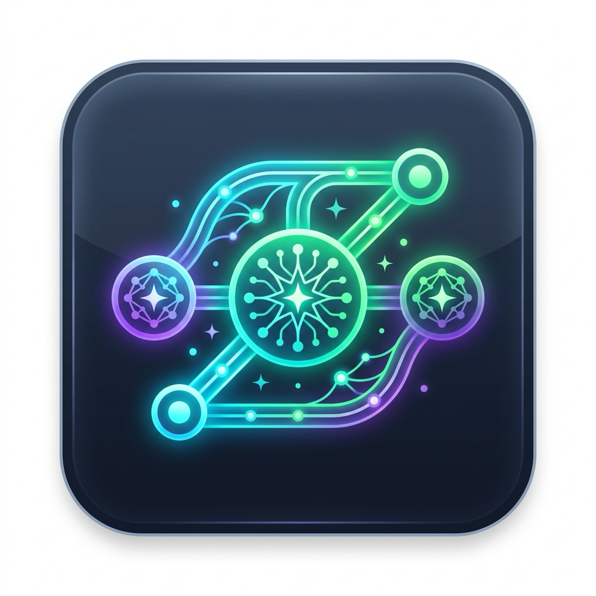

# CommitCraft (v0.1.0)

<div align="center">
  
  <p><strong>The Intelligent, GUI-First Git AI Assistant for VS Code</strong></p>
</div>

CommitCraft generates conventional commit messages, runs pre-commit code reviews, drafts Pull Request descriptions, and suggests Git branch names powered by **Google Gemini**, **GitHub Copilot / VS Code LM**, **OpenAI**, **Anthropic Claude**, **DeepSeek**, **Ollama (Local)**, **OpenRouter**, and **Groq**.

Built for maximum ease-of-use with a dedicated Sidebar, Source Control toolbar buttons, Status Bar action hub, and settings reactivity — without requiring you to use the Command Palette or memorise keybindings.

---

## Key Features

### 1. GUI-First Experience (No Command Palette Required)
- **Source Control (SCM) Action Bar**: 1-click action buttons positioned directly above your commit input box.
- **Dedicated Sidebar & SCM TreeView**: Access all actions, switch AI providers, change models, and adjust settings with a single click.
- **Status Bar Action Hub**: Click `$(git-commit) CommitCraft` in the bottom status bar for an instant popup menu.
- **Context Menus**: Right-click on files in Git SCM or in the active editor to review code or generate commits.

### 2. Standard Conventional Commits
- Generates clean, technical commit messages (`feat(scope): subject`) adhering to Conventional Commits standards.
- Zero decorative fluff, zero robotic filler text.
- Ticket & issue auto-detection: automatically identifies Jira or GitHub ticket tags from branch names (e.g. `feat/PROJ-123-auth` &rarr; `[PROJ-123] feat(auth): ...`).

### 3. Multiple Candidate Options
- Generate 3 distinct options in parallel:
  - **Conventional**: Balanced subject with concise technical bullet points.
  - **Concise**: Single-line summary without body.
  - **Detailed**: Comprehensive breakdown with rationale and context.

### 4. Pre-Commit Code Review & Security Audit
- Audits staged diffs beside your editor before committing:
  - Detects potential runtime bugs, null/undefined hazards, and unhandled rejections.
  - Flags leaked API keys, tokens, and hardcoded secrets.
  - Identifies leftover debug statements (`console.log`, `debugger`, print statements).

### 5. Pull Request & Branch Name Generators
- **PR Descriptions**: Summarizes branch history and diffs into structured Markdown (Overview, Changes, Testing, Checklist) with 1-click clipboard copy.
- **Branch Suggester**: Proposes standard branch names (`feat/...`, `fix/...`, `refactor/...`) based on unstaged or staged changes.

### 6. Multi-Provider & Local LLM Support
- **Google Gemini**: `gemini-2.5-flash` (recommended default), `gemini-2.5-pro`, `gemini-2.0-flash`.
- **GitHub Copilot / VS Code LM**: Zero-configuration built-in language models without external API keys.
- **OpenAI**: `gpt-4o-mini`, `gpt-4o`, `o3-mini`, `o1`.
- **Anthropic Claude**: `claude-3-7-sonnet-latest`, `claude-3-5-sonnet-latest`, `claude-3-5-haiku-latest`.
- **DeepSeek**: `deepseek-chat` (V3), `deepseek-reasoner` (R1).
- **Ollama (Local)**: `llama3.2`, `qwen2.5-coder`, `deepseek-r1` (100% offline & free).
- **OpenRouter & Groq**: High-speed inference and access to 100+ open-source models.
- **Custom Endpoints**: Compatible with vLLM, LM Studio, LocalAI, Azure OpenAI, and custom proxies.

---

## How to Use

### Method 1: Using the GUI (Recommended)
1. Stage your changes in Git (`git add`).
2. Click the **CommitCraft** icon `$(git-commit)` on the Source Control title bar or in the **CommitCraft Assistant** sidebar panel.
3. The commit message is generated and inserted into the commit message box automatically.

### Method 2: Status Bar
- Click **`$(git-commit) CommitCraft`** at the bottom left of VS Code to open the **Quick Action Hub**.

### Method 3: Keyboard Shortcut
- Press **`Cmd + Alt + C`** (macOS) or **`Ctrl + Alt + C`** (Windows/Linux).

---

## Commands

All commands can be accessed via GUI buttons, the Status Bar hub, or Command Palette (`Cmd+Shift+P` / `Ctrl+Shift+P`):

| Command | Description |
| :--- | :--- |
| `CommitCraft: Generate Commit Message` | Analyze staged changes and generate commit message |
| `CommitCraft: Generate Multiple Options` | Generate 3 format choices (Conventional, Concise, Detailed) |
| `CommitCraft: Pre-Commit Code Review` | Audit staged changes for bugs and security risks |
| `CommitCraft: Generate PR Description` | Generate PR description from branch history |
| `CommitCraft: Suggest Branch Name` | Suggest Git branch names based on diff |
| `CommitCraft: Quick Action Hub` | Open 1-click action popup menu |
| `CommitCraft: Quick Setup Wizard` | Step-by-step provider and model setup |
| `CommitCraft: Switch AI Provider` | Switch active provider (Gemini, Copilot, OpenAI, Claude, DeepSeek, Ollama, etc.) |
| `CommitCraft: Select Model` | Select model preset or specify custom model identifier |
| `CommitCraft: Set API Key` | Update provider API key securely |
| `CommitCraft: Set API Base URL` | Set endpoint base URL (for Ollama, vLLM, Custom) |
| `CommitCraft: Switch Language` | Set commit message language (Thai, English, Japanese, etc.) |
| `CommitCraft: Switch Commit Style` | Change formatting style (Conventional / Simple / Detailed) |
| `CommitCraft: Toggle Emojis` | Toggle Gitmoji inclusion on or off (disabled by default) |
| `CommitCraft: Open Settings` | Open VS Code Settings UI for CommitCraft |

---

## Configuration

Settings can be managed visually in the **Settings UI** (`Cmd+,` &rarr; search `CommitCraft`) or defined in `.vscode/settings.json` / User `settings.json`:

```json
{
  "commitcraft.AI_PROVIDER": "gemini",
  "commitcraft.GEMINI_API_KEY": "AIzaSy...",
  "commitcraft.GEMINI_MODEL": "gemini-2.5-flash",
  "commitcraft.AI_COMMIT_LANGUAGE": "Thai",
  "commitcraft.COMMIT_STYLE": "conventional",
  "commitcraft.EMOJI_ENABLED": false,
  "commitcraft.AUTO_STAGE": false,
  "commitcraft.AUTO_DETECT_ISSUE": true,
  "commitcraft.SHOW_STATUS_BAR": true
}
```

### Configuration Options

| Setting | Default | Description |
| :--- | :--- | :--- |
| `commitcraft.AI_PROVIDER` | `"gemini"` | `gemini`, `copilot`, `openai`, `claude`, `deepseek`, `ollama`, `openrouter`, `groq`, `custom` |
| `commitcraft.COMMIT_STYLE` | `"conventional"` | Commit format: `conventional`, `simple`, `detailed` |
| `commitcraft.AI_COMMIT_LANGUAGE` | `"English"` | Language for commit & PR messages (`Thai`, `English`, `Simplified Chinese`, etc.) |
| `commitcraft.EMOJI_ENABLED` | `false` | Enable or disable Gitmoji in commit subjects |
| `commitcraft.AUTO_STAGE` | `false` | Automatically stage all modified files when generating |
| `commitcraft.AUTO_DETECT_ISSUE` | `true` | Extract Jira/GitHub issue tags from branch names |
| `commitcraft.SHOW_STATUS_BAR` | `true` | Display status bar button |
| `commitcraft.AI_COMMIT_SYSTEM_PROMPT` | `""` | Optional custom system prompt |

---

## Extension Installation

To install manually from the VSIX package:
```bash
code --install-extension commitcraft-0.1.0.vsix
```

---

## License

[MIT](./LICENSE)
